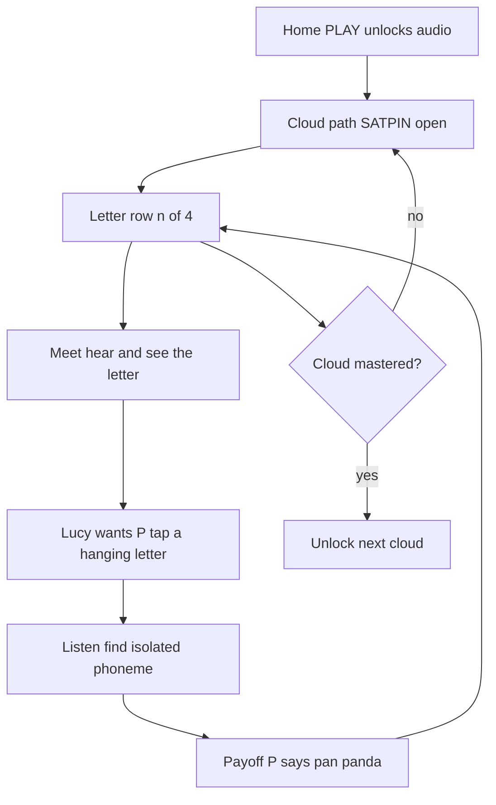

# Letters and Sounds — first-principles rebuild

## What I will steal (from the walkthrough)

- One product: Letters and Sounds. No catalog.
- Numbered cloud path. Cloud 1 = **s, a, t, p, m, i**. Later clouds locked until the open cloud is mastered.
- Per-letter `n/4` row (four short beats, not four SplashLearn clones).
- Framed play stage on a shell (workshop scene inside a rounded frame).
- Corner helper that idles, talks, and can wear/morph the target letter — implemented as **Lucy the golden retriever**, not SplashLearn’s blob.
- Single-tap choose when Lucy “wants P.” Two correct `p`s allowed in one set.
- Listen-for-`/p/` among identical-looking targets.
- Payoff card: letter + picture word (pan / panda) + glow + spoken “P says /p/.”
- Visible XP / lightning fill + a mastery celebration screen type.
- Loader motion (orbiting soft shapes) and sparkles on the map.
- Palette is **open**. Cream/sunshine chrome can stay for readability; the stage can go darker. Navy is not a brand lock.

## What I will not copy

- SplashLearn subjects, Live Classes, worksheets, upgrade chrome, or their mascot/machine art as assets.
- Click-and-drag (frame 14 is the counterexample). Keep the *juice*, change the *verb* to tap.
- Four separate P minigames as products.
- ElevenLabs / `speechSynthesis` / Web Audio “puh” as isolated phonemes.
- Hard-locking the SplashLearn navy skin.

## What I actually looked at

- The three pasted docs (`HANDOFF-VIDEO-ANALYSIS.md`, `START_HERE.md`, `PROMPT_FOR_AI.md`).
- Current app: [`app/js/round.js`](app/js/round.js), [`app/js/screens/trail.js`](app/js/screens/trail.js), [`app/js/screens/match.js`](app/js/screens/match.js), [`app/js/lucy.js`](app/js/lucy.js), [`app/js/audio.js`](app/js/audio.js), [`app/data/letters.json`](app/data/letters.json), [`app/data/audio.json`](app/data/audio.json), [`UX-FROM-STITCH.md`](UX-FROM-STITCH.md).
- I do **not** have the mp4, stills, or audio clips on this VM. The written brief is the spec.

## Premium motion is required (ages 3–4)

A 3-year-old does not read the UI. They stay for **something that is alive**. Every kid surface must move a little, all the time, and move a lot for about one second when they get it right. Then it calms down. Endless chaos loses them as fast as a still page.

**Always-on (quiet, looping)**

- Loader: orbiting soft shapes, never a blank wait
- Map: clouds bob, sparkles tick, locked clouds dim-pulse, open cloud glows
- Lucy: breathing idle in the corner on every kid screen — never a sticker
- Stage props: slight sway (cards on clips, XP bolt shimmer)

**On tap (under 120ms)**

- Press squash + lip (already in pillow cards)
- Soft pop SFX
- Selected card rings and leans forward; others dim

**On success (1–2 seconds, then stop)**

- Card flies into the “want” target (motion of SplashLearn’s machine eat, tap not drag)
- Spotlight payoff plate + letter bounce (“P!”)
- Short confetti / star burst (not a 10s fireworks loop)
- Lightning XP fills
- Lucy switches to a celebrate loop
- Star flies toward Star Pouch

**On miss**

- Wobble + Lucy nudge only. No red X, no sad trombone, no lost hearts.

**On letter/cloud mastery (skippable, cap 6–8s)**

- Full-screen “Hooray! Letter P!” / “Cloud 1 mastered” with confetti, Lucy dance, bouncing title. Tap anywhere to skip.

Do not add autoplay Higgsfield/MP4 cinematics inside the loop. Those are marketing, not a 3-year-old’s game.

## What a pro would use (and what we will not pay for)

**Do not buy / do not use for this game**

- **Blender** — 3D film tool. Wrong for a 2D tablet/smartboard PWA. Huge files, not offline-friendly.
- **Adobe After Effects / Illustrator / Photoshop** — the old Lottie pipeline. We skip AE by using LottieFiles (and AI stills) instead.
- **Framer** — a marketing-site builder. Do not rebuild the game in Framer. We already have a vanilla PWA.
- **Tailwind** — a CSS utility kit. It does not make motion. This app already has a token system in [`app/css/tokens.css`](app/css/tokens.css). Adding Tailwind is a restyle tax, not a premium upgrade. Playful UI comes from tokens + motion, not utility classes.
- **Spline / Three.js 3D** — skip for v1. Cute, heavy, distracts from letters.

**Use this stack (mostly free, web-native, cacheable in the service worker)**

| Job | Tool | Why |
| --- | --- | --- |
| Character + loader + icon motion | **Lottie** (`lottie-web` / dotLottie) + [LottieFiles](https://lottiefiles.com/) | Vector, tiny, sharp on a smartboard, works offline, vanilla JS (no React). [Lordicon](https://lordicon.com/) is the same format for UI icons. |
| Screen juice (tap, XP bar, floating “P!”) | **CSS** + **Motion** (the vanilla JS library, formerly Framer Motion) | Layout/tap/physics without a new design tool. |
| Confetti / star burst | `canvas-confetti` (or equivalent, few KB) | Mastery and payoff only. |
| Interactive Lucy later | **Rive** (free editor) | State machine: idle / talk / celebrate as one file. Better than Lottie *once* Lucy needs tap-react. Not the first file we add. |
| Still plates (clouds, pan silhouette, tiles) | Cursor **GenerateImage** + optional Higgsfield stills | Cartoon plates we crop into the stage. |
| Marketing trailer only | [Higgsfield in Cursor](https://higgsfield.ai/cursor) | 10s cinematic of Lucy. Not an in-game asset. Connect the plugin on Desktop if you want this. |
| Phonemes | Your ripped recordings in [`app/audio/`](app/audio/) | Still the one thing AI cannot do. |

**Connect / install when we start building (you, on Desktop)**

1. LottieFiles account (free) — download loader, sparkle, check, confetti-adjacent icons we will vendor into `app/lottie/` (check each file’s license; prefer free-for-use).
2. Optional: Higgsfield Cursor plugin — stills + a Lucy trailer, not gameplay.
3. Optional later: Rive editor if CSS+Lottie Lucy still feels flat.
4. Isolated SATPIN phoneme files.

I will vendor `lottie-web` locally (no CDN) so the cart Chromebook stays offline.

## Images — what we generate vs what we draw in code

The app already has a full A–Z **64px SVG sticker sheet** in [`app/js/art.js`](app/js/art.js) and emoji fallbacks. Those read as worksheets, not as SplashLearn. First slice adds a small **illustrated plate set**, not 400 paintings.

**Draw in CSS/SVG (no generator, sharper on a smartboard)**

- Cloud path, flags, locks, dotted line, XP lightning, hanging-card frames, listen orbs
- Letter glyphs (Comfortaa, single-storey a/g)
- PWA / favicon (already in [`app/icons/`](app/icons/))
- Living Lucy body (existing SVG)

**Generate as raster stills** (`app/art/…`, WebP, precached in `sw.js`)

Style lock for every prompt: cartoon, thick outlines, flat candy/sunshine color, **not photoreal**, no SplashLearn blob, no brands, readable at 10 feet, Lucy-world if a dog appears.

| File | Use |
| --- | --- |
| `art/stage/workshop.webp` | Framed play-stage backdrop (original workshop, not a clone) |
| `art/thumbs/meet.webp` | Letter-row thumb 1 — hear/see |
| `art/thumbs/choose.webp` | Thumb 2 — tap the letter |
| `art/thumbs/listen.webp` | Thumb 3 — find the sound |
| `art/thumbs/payoff.webp` | Thumb 4 — picture word |
| `art/words/s-sun.webp` | Payoff plate |
| `art/words/a-apple.webp` | Payoff plate (upgrade the tiny SVG) |
| `art/words/t-tree.webp` | Payoff plate |
| `art/words/p-pan.webp` | Payoff plate (the walkthrough word) |
| `art/words/p-panda.webp` | Second P payoff |
| `art/words/m-moon.webp` | Payoff plate |
| `art/words/i-igloo.webp` | Payoff plate |
| `art/celebrate/hooray.webp` | “Hooray! Letter _ mastered” room |

Four thumbs are **reused** for every letter, with the grapheme drawn on top in CSS. That is how a pro ships Cloud 1 without painting 24 unique SplashLearn tiles.

**Not in this slice:** unique art for clouds 2–5, photoreal Lucy, kid photos, marketing site hero, OG social cards, closet clothing paintings.

**Tools**

- **Cursor GenerateImage** — primary. I run it during the build (you already asked for these assets). One style prompt, then the table above. If a plate is ugly, regenerate that id only.
- **Higgsfield** (optional, you connect on Desktop) — higher-end stills or a skippable Lucy trailer. Same style lock. Not required to start.
- **Existing SVG stickers** — stay as fallback if a WebP 404s offline.
- Do not add Midjourney / Adobe Firefly / Framer as a dependency.

## Tools / gaps (said now, not faked later)

- **Isolated phonemes (locked: legal CC/PD, not LoE/Starfall):** Vendor SATPIN from **Wikimedia Commons IPA clips** (CC BY-SA 3.0, attribution in `app/audio/LICENSES.md`) or a **Freesound** pack whose license is CC0/CC-BY (not NC). Map `/s/ /æ/ /t/ /p/ /m/ /ɪ/` to `phoneme-S` … `phoneme-I`. Never scrape Logic of English or Starfall. Linguistic Commons clips are allowed; if they sound too academic for 3-year-olds, replace later with a classroom recording. Until files exist, listen-round is silence + Lucy’s line, never TTS.
- **Lucy Lottie:** we will not invent a fake “AI Lottie of your real dog” in one shot. Path: living SVG Lucy on day one (breathing, blink, tail, talk) + a Lottie *slot* (idle / talk / celebrate). Swap files in when we have a Lucy-like golden retriever animation (LottieFiles + GenerateImage reference sheets, or Rive later). Never a static PNG.
- **Higgsfield:** useful, not required for the first playable slice. Best as reference stills and a home-screen “meet Lucy” clip you can skip.
- **Computer-use on your Mac:** do not restart `lucy-mac` for this work.

## First-principles loop (this is the game)

A letter is “done” when its four beats are complete. A cloud is mastered when every letter in it is done. Child may pick **any letter in the open cloud**. Grown-Ups keep **pin today’s letter** as a highlight *inside* the open cloud, plus a teacher override to unlock the next cloud so a classroom is never stranded.

Classroom pieces that stay: roster, face grid, PIN, offline PWA, Music/SFX/Voice toggles, Lucy closet / Star Pouch.

## Conflicts — locked calls

- **All-26-awake trail** ([`trail.js`](app/js/screens/trail.js)) is replaced by cloud locks. Teacher pin no longer means “every letter is playable.”
- **Two-tap true match** ([`match.js`](app/js/screens/match.js), [`UX-FROM-STITCH.md`](UX-FROM-STITCH.md)) leaves the kid path. New loop is single-tap. Do not keep both as kid-facing modes.
- **Cream tokens** stay for chrome and type (whiteboard contrast). Stage interior can use a darker framed theme. Candy/ocean stay as later skins, not this slice.
- **Lucy stays a dog.** Steal corner presence + idle + letter-badge morph, not a blob replacement.

## What changes in code

### Data

- Add [`app/data/clouds.json`](app/data/clouds.json): five clouds (SATPIN, f n o d c h, g u b l k e, r w j v y z q x, Revision).
- Track per-kid per-letter beat progress (`0/4`) next to existing stars in [`app/js/store.js`](app/js/store.js).
- Keep [`letters.json`](app/data/letters.json) for words/pictures; `awake` becomes “letter is in an unlocked cloud.”

### Map

- Rewrite [`app/js/screens/trail.js`](app/js/screens/trail.js) as the cloud path: numbered flags, dotted connector, glow on the open cloud, locked neighbors, chevrons if needed, per-letter row with four scene thumbs + `n/4`.
- Rename the tab from “ABC Trail” to “Letters and Sounds” in [`app/js/app.js`](app/js/app.js).

### Play

- New round steps in [`app/js/round.js`](app/js/round.js): `meet → choose → listen → payoff` (then existing short celebrate).
- New stage screen (e.g. `app/js/screens/stage.js`) + CSS: rounded picture-frame, hanging tap cards, lightning XP, Lucy docked bottom-left or corner, payoff plate with glow. No drag handlers.
- Choose trial: 4 hanging letters, Lucy line “I want the letter P,” possibly two correct `p`s. Wrong tap = soft wobble + nudge, never fail the letter.
- Listen trial: 3 identical orbs; only one is bound to `audio.sayPhoneme()`. Tap Lucy = replay prompt.

### Lucy / motion

- Vendor `lottie-web` + a small motion helper. Precache `app/lottie/*.json` in `sw.js`.
- Living SVG Lucy in [`app/js/lucy.js`](app/js/lucy.js) on day one (breath, blink, tail, talk). Mount a Lottie layer in the same corner slot for idle / talk / celebrate when those JSON files exist.
- Lottie loader on first paint in [`app/index.html`](app/index.html) (abstract shapes, not SplashLearn IP).
- Payoff: existing spark burst in [`app/js/ui.js`](app/js/ui.js) plus a 1-second `canvas-confetti` burst and a bouncing grapheme.
- Map sparkles + cloud bob. Celebrate screen uses the same burst language, skippable, ≤8s.

### Audio (replace the toy oscillators)

Today [`app/js/audio.js`](app/js/audio.js) *synthesizes* everything: a sine-note “playground wander” for music, and `tone()` blips for tap/select/right/wrong/star/pop/woof. That is why it sounds cheap. We will stop using oscillators for music and SFX.

What I will do in the first slice:

- Vendor a **CC0** kids-safe music loop (Kenney music loops / jingles first — free for later monetization, attribution optional). Soft, looping, no lyrics, no jump-scare drops.
- Vendor a **CC0** UI pack for tap, correct, miss (gentle), star, pop. Map them onto the existing `audio.sfx('tap'|…)` names so the rest of the app does not change.
- Keep Music / SFX / Voice toggles and the duck-under-voice behavior.
- Precache new files in `sw.js`. Add a short `app/audio/LICENSES.md` so we never lose the CC0 trail.
- Isolated **phonemes** stay your job. I still will not generate or scrape those.

What I will not do:

- Suno / Udio / ElevenLabs music as the shipped bed (license is messy if you monetize later).
- AI “woof” or sad-trombone miss sounds.
- Replacing Lucy *speech* in this slice (device TTS for lines is OK until you record).

If Kenney’s loops feel too “game-jingle,” we swap the bed for a warmer CC0/Pixabay ukulele-or-xylophone loop in a follow-up — same wiring.

**Leave alone unless they block the loop**

- Grown-Ups, printables, CSV, closet, service worker shell (only add new files to `SHELL` + bump version).

## Gate: Stitch layout before kid chrome

Bradley is producing a Stitch layout for the shell (map, stage frame, home). **Do not build the kid UI until that export is in this chat** (screens + notes, or files pasted). Stitch is the layout. The walkthrough is the loop and motion bar. Starting the cloud path / framed stage now means rebuilding it when Stitch lands.

Safe to do *after* go, if he wants overlap: `clouds.json`, round-step data, CC0 audio vendor, phoneme contract. Not the painted screens.

## First slice vs later

**This slice (one PR):** Cloud 1 playable end-to-end for **P**, then the same loop wired to S A T M I. Lottie loader + living Lucy + tap juice + confetti payoff + framed stage + cloud lock. Real CC0 music loop + UI SFX (no more oscillator bed). Placeholder phonemes until you drop files.

**Not this slice:** Clouds 2–5 content, candy/ocean skins, iOS/Android, Rive Lucy, Higgsfield in-game video, scraping phonics sites, cloning SplashLearn workshop art, Tailwind rewrite, Framer rebuild, computer-use tours.

## Proof

- Browser: Cloud 1 path, lock on cloud 2, open letter P, tap-choose (no drag), listen-for-sound, payoff glow, `n/4` ticks, Lucy idling in the corner.
- Automated: extend [`app/_check.mjs`](app/_check.mjs) / [`app/_flow.mjs`](app/_flow.mjs) for the new steps and cloud lock rules.
